# 🛒 Shopping Cart App (Flutter + Firebase)

[](LICENSE)

## 📱 Overview

A simple **Shopping Cart application** with buyer and seller modules, built using **Flutter** and integrated with **Firebase Firestore** for real-time database management.

---

## ✨ Features

- 👤 **Buyer Module**
  - View products in real-time
  - Add products to cart with quantity selection
  - Checkout cart items

- 🛍️ **Seller Module**
  - Add new products
  - Update existing products
  - Delete products
  - Manage inventory

---

## 🚀 Setup Instructions

1. **Clone the repository**

   ```bash
   git clone https://github.com/callmeNoorulHuda/Flutter-Shopping-App
   cd Flutter-Shopping-App

```

2. **Install dependencies**

   ```bash
   flutter pub get
   ```

3. **Firebase Configuration**

    * Create a project in Firebase Console.
    * Enable Authentication (Email/Password) and Cloud Firestore.
    * Download your Firebase config files and add them:

      ```
      android/app/google-services.json
      ios/Runner/GoogleService-Info.plist
      ```

4. **Run the app**

   ```bash
   flutter run
   ```

> ⚠️ 🔑 Note: google-services.json and GoogleService-Info.plist are ignored for security. Add your own from Firebase Console after setup.
---

## 📂 Folder Structure

```
lib/
┣ authorize/           # Authentication and authorization       
┣ models/              # Data models (Product, CartItem)
┣ ui/
┃ ┣ screens/
┃ ┃ ┣ buyer/           # Buyer screens
┃ ┃ ┗ seller/          # Seller screens
┣ widgets/             # Login screen and splash screen
┗ main.dart            # App entry point
```

---

## 🛠️ Technologies Used
- **Flutter – Frontend UI development**

- **Firebase Authentication – User login and signup**

- **Cloud Firestore – Real-time database**

- **Dart – Programming language for Flutter apps**

## 📸 Screenshots

### 🖼️ **App Logo**

<p align="center">
  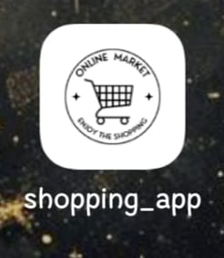
</p>

### 🖼️ **Login Screen**
<p align="center">
  
</p>

### 🔑 **Authentication Screens**

| Buyer Login                                                                    | Seller Login                                                                    |
|--------------------------------------------------------------------------------|---------------------------------------------------------------------------------|
| 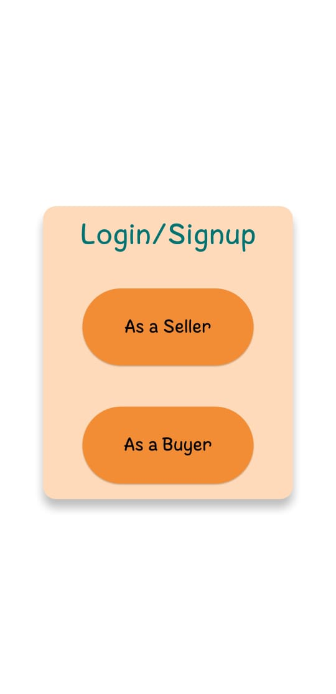 | 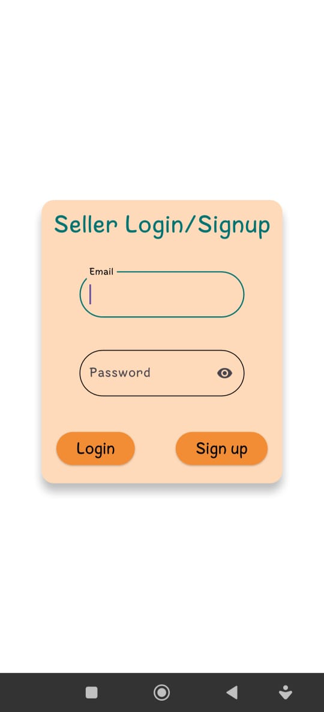 |

---

### 🛒 **Buyer Module**

| Home Screen                                                                 | Add to Cart                                                                   | Cart Screen                                                                   |
|-----------------------------------------------------------------------------|-------------------------------------------------------------------------------|-------------------------------------------------------------------------------|
| 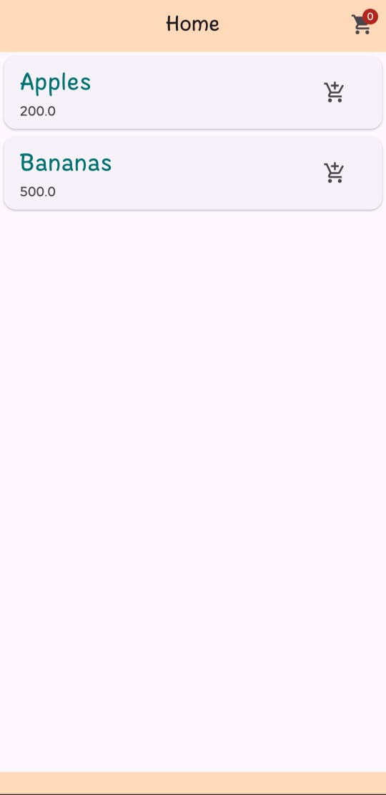 | 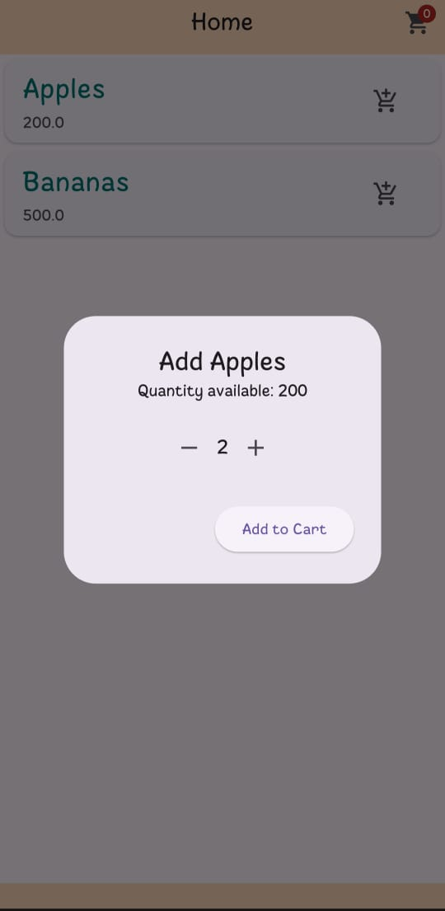 | 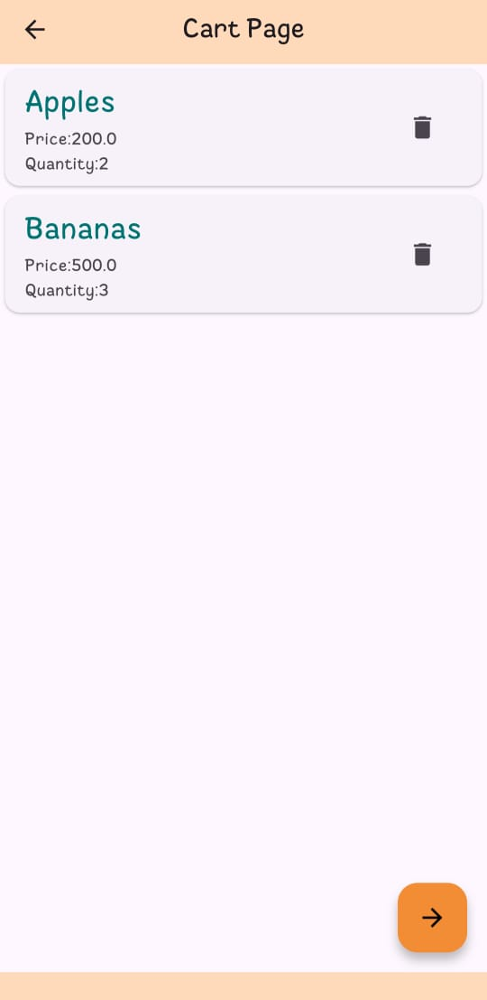 |

| Remove Item                                                                   | Checkout                                                                              | Checkout Complete                                                                 |
|-------------------------------------------------------------------------------|---------------------------------------------------------------------------------------|-----------------------------------------------------------------------------------|
| 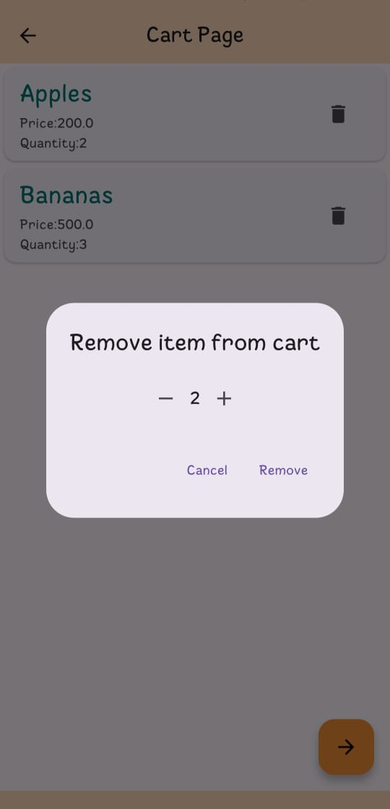 | 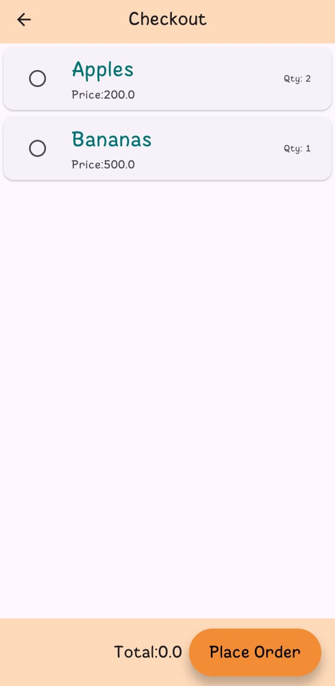 | 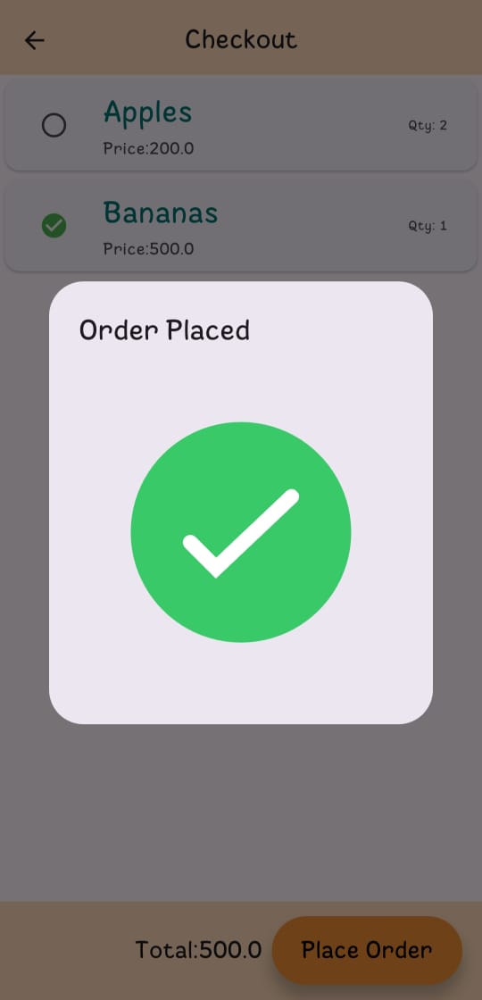 |

---

### 🏪 **Seller Module**

| Seller Home                                                                   | Add Product                                                                   | Edit Product                                                                    |
|-------------------------------------------------------------------------------|-------------------------------------------------------------------------------|---------------------------------------------------------------------------------|
| 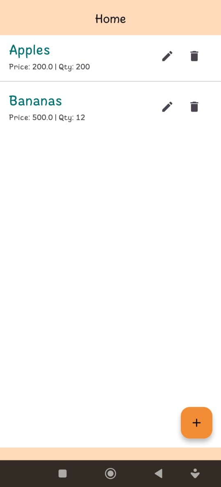 | 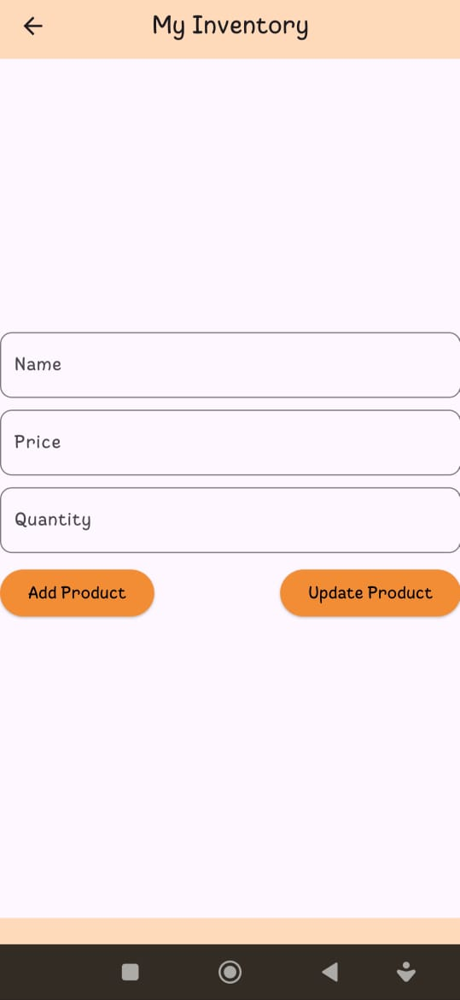 | 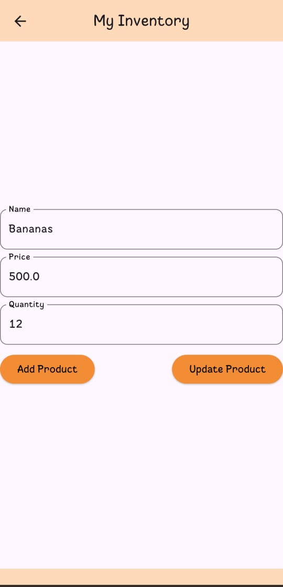 |

---


## 🎬 Demo

[](YOUR_LINKEDIN_POST_URL)

> Click to view the full app demo on LinkedIn.

---

## 🤝 Contributing

```
Pull requests are welcome. For major changes, please open an issue first to discuss what you would like to change.
```

